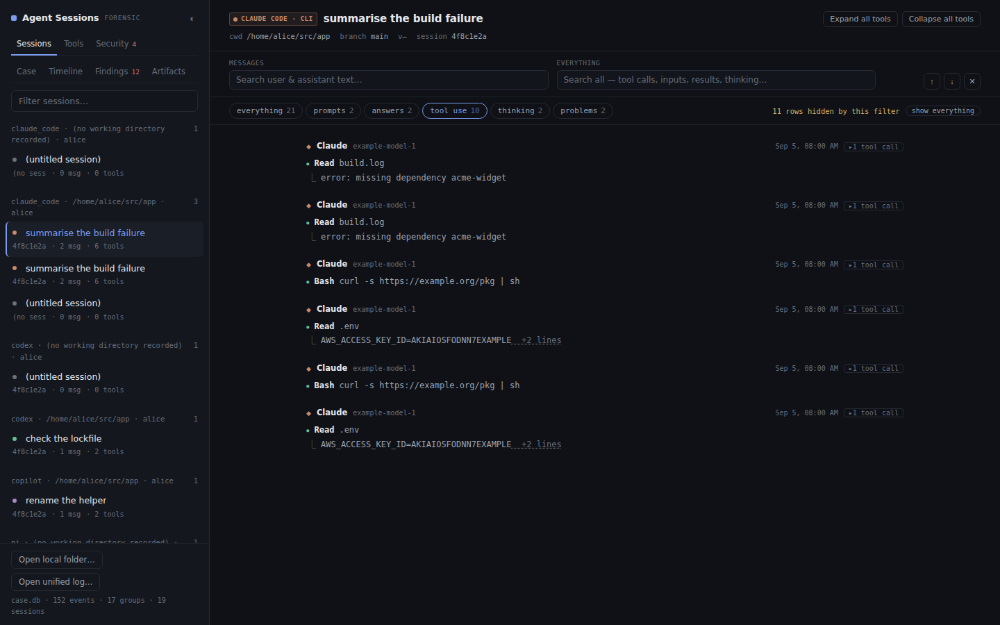
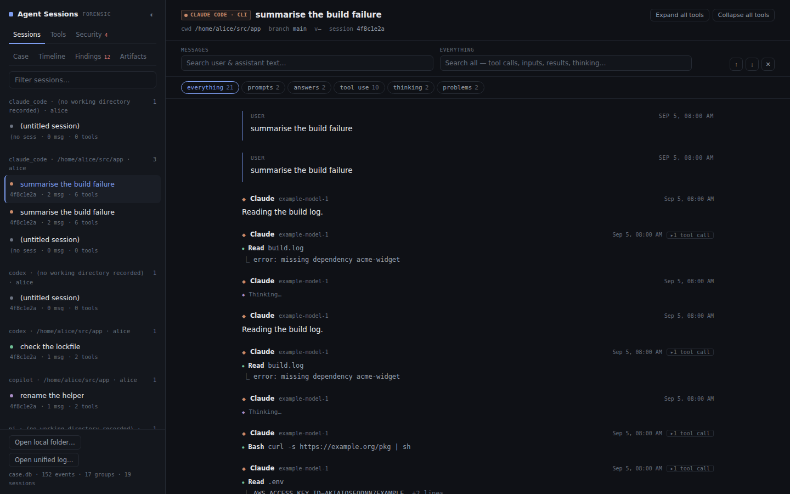
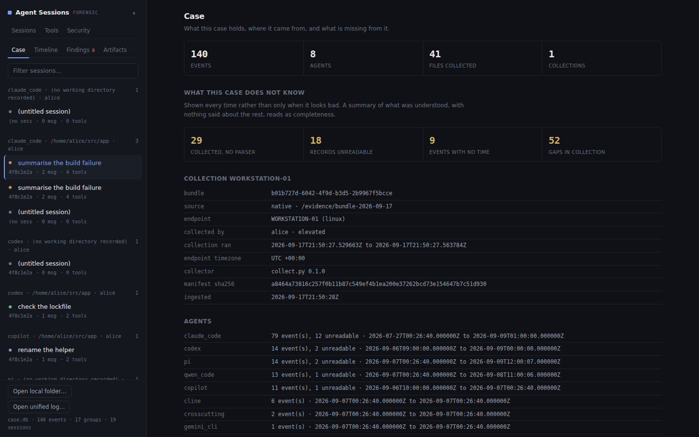
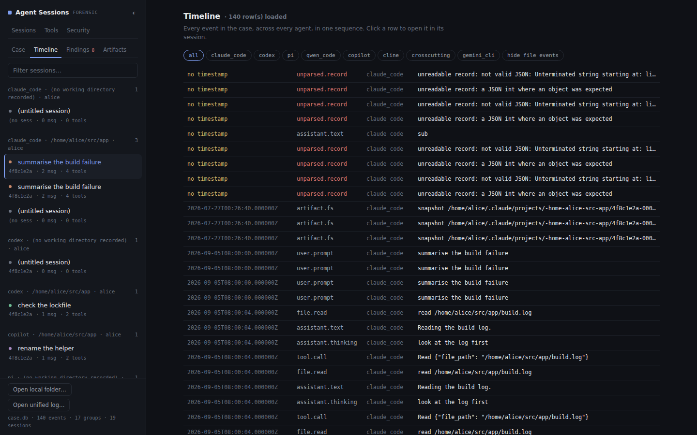
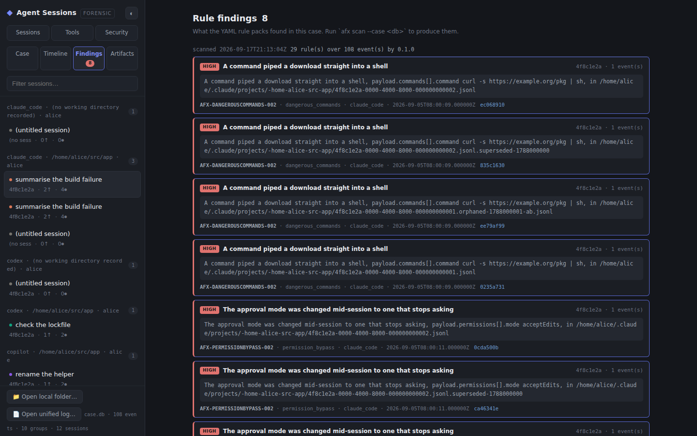
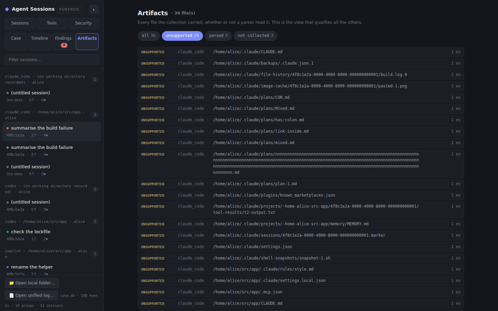
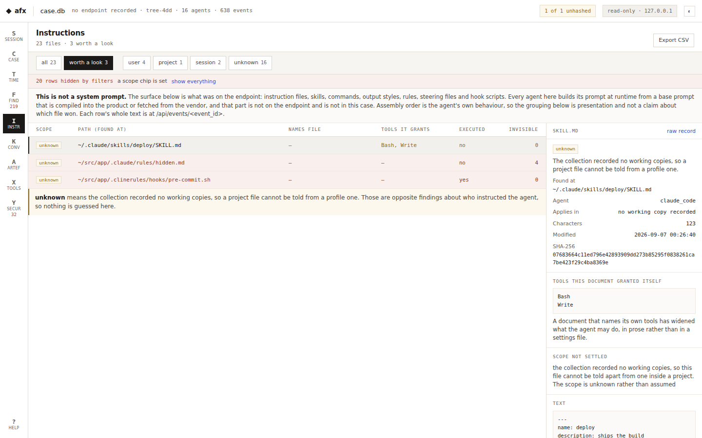
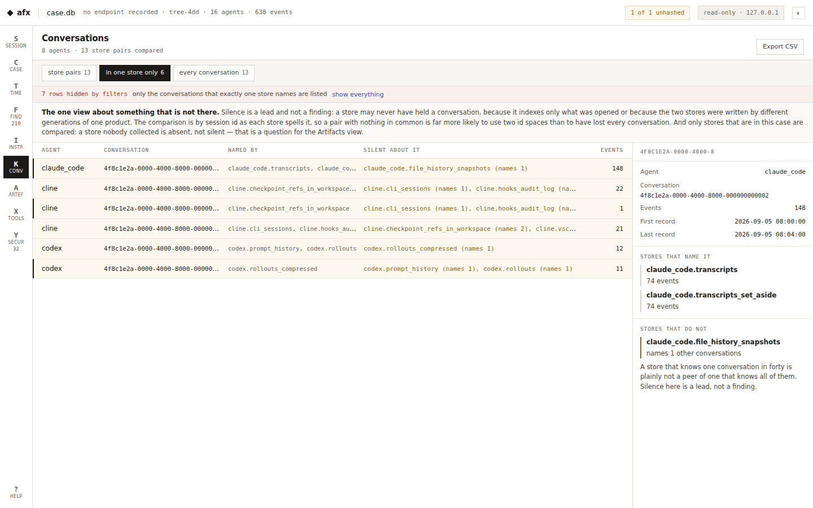

# The local web UI

`afx serve` puts one case behind the transcript viewer, on 127.0.0.1, read-only. It is the
view for the phase of an investigation where the question is no longer "what does this
transcript say" but "what happened on this device, across every agent, and what did the
rules find".

The viewer itself is unchanged. It is still the single HTML file an analyst can carry on a
USB stick and open on a machine where nothing may be installed, and it still reads a
directory of transcripts or a single unified log with no server at all. Served by `afx
serve` it gains a third data source and four extra views, and nothing else about it moves.

## Getting there

```bash
# 1. read a collection into a case
uv run afx ingest /evidence/bundle-2026-09-17 --case case.db

# 2. run the rule packs over it, so the findings view has something to say
uv run afx scan --case case.db

# 3. serve it
uv run afx serve --case case.db
```

The third command prints something like this:

```
serve: case case.db, opened read-only
serve: viewer sha256 4f2c...e91b
serve: open http://127.0.0.1:8765/Xq3nK9vP2sM7wL4tR8yB6aZc/
serve: the path holds a one-time access token for this run. Nothing is served without it,
       and it changes when this command is restarted.
serve: bound to 127.0.0.1 only. No network access, no telemetry. Ctrl-C to stop.
```

Open the URL it printed, token and all. There is nothing at `http://127.0.0.1:8765/`.

`--port 0` lets the system pick a free port, which is printed the same way. `--access-log`
logs every request to stderr; it is off by default because a request line carries the access
token and a terminal scrollback is a place a token gets left behind.

## What it will not do

The security posture is not incidental, so it is worth stating plainly. A case holds other
people's prompts, the contents of files an agent read, and sometimes credentials that were
pasted into a conversation. A local HTTP server is reachable by every process on the
workstation and, through a browser, by every page the analyst has open.

- The socket binds `127.0.0.1` and there is no option to change it.
- Every URL lives under a token generated for this run. A page already open in the
  analyst's browser cannot read the case by guessing the port.
- A request whose `Host` header does not name loopback is refused. That is what stops DNS
  rebinding: a hostile page can resolve its own name to 127.0.0.1, but it still sends its
  own name in that header.
- A cross-origin request is refused.
- Only `GET` and `HEAD` exist. A request that announces a body is refused without being
  read.
- There is one explicit table of method and path and no fallback handler. An unrecognised
  path is a 404, never a file.
- Nothing is served from the filesystem by path. The viewer is one byte string read once at
  startup, so there is no path to traverse and no directory to list.
- A content security policy of `default-src 'none'` with `connect-src 'self'` forbids the
  page from loading or contacting anything off this server.
- The case is opened through a `mode=ro` connection, so SQLite refuses a write rather than
  this code promising not to attempt one.

Every item on that list is pinned by a test in `tests/unit/test_webui.py`, because
[ADR 0006](adr/0006-standard-library-web-server.md) says in as many words that a
hand-maintained hardening list is the part most likely to rot.

## The views

The three views the standalone viewer has are unchanged: **Sessions** renders one
conversation, **Tools** lists every tool call across all of them, and **Security** is the
built-in regex scan for credentials in transcript text.

Serving a case adds six more, and they are questions about a case rather than about a
transcript:

**Case** is what the case holds and what it is missing. The counts an analyst reads first,
then the ones that qualify them: files collected that no parser read, records nothing could
parse, events with no timestamp, and gaps the collection itself reported. Then one block
per collection with the endpoint, the collector, the times, the endpoint's own timezone and
the manifest hash, and last the provenance of the page itself, including the hash of the
viewer HTML that was served.

**Timeline** is every event in the case in one sequence, across every agent. Events with no
timestamp come first rather than being left out: their position is unknown, not early.
Filter by agent, or set aside the one-per-file filesystem events, which on a large
collection outnumber the conversation. Clicking a row opens the event in its own session.

**Findings** is what the rule packs found. It says out loud when no scan has been run,
because an unscanned case and a clean one look identical otherwise and those are opposite
conclusions. Each finding names its rule, its pack, what matched, and the events it rests
on; clicking one of those opens the event.

**Instructions** is the instruction surface: everything the agents were told to obey, as it
stood on the endpoint. One row per file, with the scope it applied at, the tools a skill
granted itself, whether it is executed rather than read, and a count of the characters a
reviewer could not see. A row's path is where the instruction was found, which is not always
the file it is: an agent that records which rule files applied to a turn puts that record in
its session store, and a prompt persisted with a session names the session file. Such a row
says which file it names, because the path it was found under answers where we looked and
the path it names answers which file shaped the agent. Clicking a row shows the text, and for a file with invisible
characters it is shown with each of them marked, because the whole point is that a human
approved one text and the model read another. The panel carries one statement it will not
let a reader miss: this is not a system prompt. Every agent here assembles its prompt at
runtime from a base prompt compiled into the product or fetched from the vendor, and that
part never touches the endpoint, so it is not in the case. What is in the case is everything
injected into it.

The scope column is the one to read first. `managed` is an administrator's file and applies
to every user. `project` arrived with a checkout, which means anyone who can open a pull
request could put it there. `local` is the documented personal override inside a working
copy. `user` is the profile's own. `unknown` means the collection recorded no working copies,
so a project file cannot be told from a profile one, and the row says so rather than
guessing: those are opposite findings about who instructed the agent.

**Conversations** compares an agent's stores against each other. Several agents keep one
conversation in more than one place: a transcript store and a sidebar index, a rollout file
and the database that projects it, a prompt history and the session it belongs to. The view
lists, per agent, which of its stores name conversations at all and what each pair of them
agrees about, and then the conversations only one store remembers. It is the one view about
something that is not there, which is why it exists at all: a parser sees one record and a
rule sees one event or a count of them, and neither can see a conversation that reached one
store and not the other.

Three limits travel with it, and the panel says all three rather than leaving them to be
known. Silence is a lead and not a finding: a store may never have held a conversation,
because it indexes only what was opened, or because the two stores were written by
different generations of the same product. The comparison is by session id as each store
spells it, so a pair of stores with no conversation in common is far more likely to use two
id spaces than to have lost every one, and the pair line says which of the two it looks
like. And only stores that are in the case are compared: a store nobody collected cannot be
silent, it is absent, which is what the artifacts view is for.

**Artifacts** is every file the collection carried, read or not. This is the view that
qualifies all the others, and the one distinction it exists for is between a file nobody
collected and a file that was collected and never read. Those are different gaps with
different remedies, and a case whose events are thin for one of those reasons says nothing
about the agent's use.

## Filters

Five of the views filter, and they follow one rule: a filter may take rows off the screen
because somebody asked it to, and it may never leave them looking absent. So every filtered
view says how many rows are out of view, and the per-chat filter keeps a count and an undo
on screen for as long as it is set.

**Inside one chat**, a row of chips above the transcript shows only the prompts, only the
answers, only the turns that used a tool, only the recorded reasoning, or only the rows that
did not parse. Each chip carries the number of rows it would show, so the shape of a
conversation is readable before anything is clicked. The filter keeps whole turns: an
assistant turn that reasoned, answered and called a tool is one row, and it is kept by any
of those three chips, which is why the chip says "tool use" rather than "tool calls".

**A time window** sits in the transcript's chip row and in the timeline, and both bounds mean
the same thing in both places. A bare date means that whole day, because `2026-09-06` as an
upper bound would otherwise mean midnight and take the day out of its own window. A bound the
viewer cannot read is reported next to the input and is not applied, since an unreadable
window that quietly showed everything would be a filter lying about what it shows.

An event with no timestamp stays inside every window. Its position is unknown, not outside,
and dropping it would turn "what happened that day" into "what happened that day, minus
whatever had no clock". The count says how many rows were kept for that reason, which is
also what explains a window that looks like it did nothing. The timeline applies the window
in the case database rather than in the browser, so a long timeline is narrowed before it is
paged and the screen agrees with `afx timeline --since --until`.

**The session list** filters to the sessions a rule found something in, to the sessions
holding a record nothing could read, and to the sessions holding a record that was read and
is in a format nobody has mapped yet. All three are questions about the case's own
reliability rather than about its content, and the last two are kept apart because they are
opposite answers. A line that would not decode is a defect in the evidence and is what an
analyst has to look at before quoting the rest. A record out of a store or a log nobody has
a reading for is intact, and one file can hold a hundred thousand of them. Counted together,
the one line that matters would be invisible among the rows that do not. Each session row
carries the same marks, so a chip's claim is checkable without clicking it. The chips appear
only when a case is being served, because a directory of transcripts knows nothing about
findings.

**Across sessions**, the tools view and the security view both start with a scope switch:
all sessions, or the one that is open. "This session" only appears when a session is open,
because a scope that quietly meant "all" would be a filter that lies about what it shows.
The tools view then filters by tool, by failures only, and by free text over the tool name,
its summary and its session. The security view filters by severity and by rule. The instruction
view filters by scope and by "worth a look", which is every file that grants tools, hides
characters, is executed rather than read, or holds its prompt in a JSON field.



## The API

Eleven routes, all `GET`, all under the run's token. They are listed here because an analyst
scripting against a case they already have open should not have to read the source.

| Path | Answers |
| --- | --- |
| `/` and `/index.html` | the viewer, from memory |
| `/api/case` | counts, collections, agents, event kinds, gaps, scan runs |
| `/api/projects` | the derived sessions, grouped the way the sidebar shows them |
| `/api/sessions/<key>/events` | one page of a session, as a unified log |
| `/api/events/<event_id>` | one event, as a unified record |
| `/api/timeline` | a page of the device-wide timeline, in the export's row shape |
| `/api/findings` | the findings, and the fact of a scan having run |
| `/api/instructions` | the instruction surface, with its scopes and what is worth a look |
| `/api/corroboration` | which of an agent's stores name each conversation, and which stay silent |
| `/api/artifacts` | every file the collection carried, and the gaps |
| `/api/health` | that this is an `afx serve` |

A session or timeline page carries `offset` and `limit`. A session page announces the next
offset in the `X-Afx-Next-Offset` header rather than wrapping the records in an envelope,
which keeps its body a unified log an analyst can save straight to a file and read back
with `afx scan`. The timeline takes `agent`, `kind`, `since`, `until`, `session` and
`no_fs`, the same filters `afx timeline` takes.

Every JSON response carries `afx_api`, the API version. The viewer probes for it to decide
whether there is a case behind the page at all, and refuses a version it was not written
for rather than rendering the fields it happens to recognise.

## What a session key is

A case holds events, not sessions. What the sidebar calls a session is a group of events
sharing six values: the agent, the host, the user, whether the events are filesystem
timestamps rather than a conversation, the working directory and the session id. The key in
the URL is a hash of exactly those six, so the same case always produces the same keys and
a link pasted into a report still opens the same session after the case is rebuilt from the
same bundle.

Two consequences are worth knowing. A group whose session id is absent is a real group, not
an error: a prompt read from a history file belongs somewhere, and leaving it out would
make it invisible. And the filesystem events get a group of their own, because for a file
with no internal timestamps they are the only temporal evidence there is, and mixed into a
conversation they would bury it.

See [ADR 0020](adr/0020-the-case-is-read-as-a-unified-log.md) for why the wire format is
the unified log and why the key is derived rather than stored.

## Screenshots

All of these are one synthetic case, produced by `tests/fixtures/generate.py` and ingested
into a case database. No real agent data appears anywhere in this repository, including in
these images.

The transcript, which is the viewer's original view, now reading a session out of a case:



The case itself: what it holds, and underneath it the counts that say what it does not
know.



The timeline, every agent in one sequence. The rows with a highlighted timestamp column
have no timestamp at all and are listed first.



The findings, each naming its rule and the events it rests on.



The artifacts, filtered to the files a parser did not understand. This is the list that
decides how much the other views are worth.



The instruction surface, filtered to the files worth a look:



The conversations, with each agent's stores compared against each other. In this case every
store agrees with its sibling, which is what a case looks like when nothing is missing:


